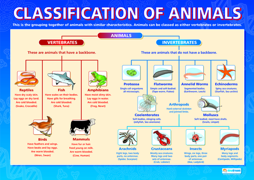

## Serverside rendering with React, Express and Silex

This prototype shows how React pages can be rendered on the server. It depends on php7.0-cli and nodejs. To install run these commands:

- `composer install`
- `npm install`

The following commands are available to run the prototype:

- `npm run start` build js, starts Express, starts Silex
- `npm run start_twig` build js, starts Express, starts Silex and uses Twig for rendering html
- `npm run watch` watches and build the javascript files when changed
- `npm run build` builds the javascript into a single bundle with sourcemaps
- `npm run build_min` builds and uglifies the javascript into a single bundle with sourcemaps
- `npm run express` start Express, outputs rendered page as html
- `npm run express_twig` start Express, outputs rendered page as json
- `npm run silex` starts Silex, forwards the rendered html from Express to the browser
- `npm run silex_twig` starts Silex, renders the page using a Twig template and the json data rendered by Express

#### The application

The application is a simple tree that represents the classification of animals:

You can click through the categories and access specific categories directly via the breadcrumb trail or by using a direct url, see below.

#### How it works

The frontend is a React application using Flux and Flux reducers for state management and Router5 for updating the history entries as the user clicks through the categories.

In the file `src/js/misc/data.js` you see a json representation of the diagram shown in the image above. The file `src/js/misc/api.js` creates an API which is an object that exposes handy functions to access that json data. For instance `getBreadCrumbLinks()` returns an array containing the consecutive links that make up the breadcrumb trial to a certain category.

The application is url-driven, which means that the url in the address bar sets the state. When the API object initializes, it also creates routes for every category. A route is a pojo that contains a key for path, name and label. The route objects are distributed throughout the application by the state changes.

The only actual view of the application is `src/js/components/page.js`, it shows the breadcrumb trail, some information about the current category and dependent on whether the category has subcategories, a list of links to its subcategories or a list of examples of animals belonging to that category.

So the page component contains quite some links and every link gets hydrated by a route object from the state. By clicking a link we tell the router to navigate to that route and because every state of the page has its own unique url we can easily infer the new state from the route.

#### Rendering on the server

Rendering a React application on the server is done by using the function `renderToString` which is part of the `react-dom/server` module. The input is the same app component as you would use for client side rendering, and the output is a string that you can send to a browser as the body of a http response message.

The only restriction is that your app can not use browser APIs that don't have a Nodejs implementation, such as for instance the Audio API.

This prototype uses an Express server to render the page with React and a Silex server to eventually serve the page to the client. At first sight this might look like overkill, but is actually is a very easy way to mix php generated content with React generated content.

An example of such a mix is when you run `npm run start_twig`: now the page served to the client is a Twig template that will be rendered using the json data that is generated by the Express server.

Another advantage of using Express behind Silex is that we can use http caching so we don't have to re-render page that have already been rendered by React.

#### Transferring the initial state from server to client

Because our application is url-driven, we set the initial state of the application by forwarding the url in the address bar of the browser from Silex to Express and then to the Router5 instance of the application. Now the state of the serverside rendered app is in sync with the url. But because clientside rendering takes care of subsequent state changes, the clientside state must be in sync with the initial url as well.

This is accomplished by using a global variable that holds the initial state. You can see this in `src/js/browser.js`; the path of the initial server state is fed to Router5 so it can update the Flux reducer that reduces the state of the Page. Reversely you can see in `src/js/server.js` and `src/js/misc/template` how the initial state gets added to the global scope.

[Update Aug 1st 2017] Because in this application the state and the url are basically the same, we don't need to set a global variable that holds the initial state; we can simply use the url to set the initial state.

#### Using a javascript or a Twig template

A React application is mounted to a single element on a html page. When we render a React application on the server, the result is a string that only contains the elements generated by React and does not contain an embedding html page.

The prototype has two ways to solve this; the first one injects the app string (the string that is the output of `renderToString`, see above) in a javascript template string, see `src/js/misc/template`. As you can see the title of the page and the global initial state are added here as well.

The second solution is to use Twig to generate an embedding html page; this solution gives us fine-grained control over which parts of a page are dynamic and what technology renders the dynamic parts, php or javascript.

#### Rendering when javascript is disabled

The typical use case of serverside rendering is when only the initial page is rendered on the server and all following pages or state updates are handled by clientside rendering. This way the initial page loads much faster and moreover it can be indexed by search engines.

However serverside rendering can be used for serving your app to devices that don't support javascript or have poor cpu power as well. It was fairly simple to add this to our prototype because all our state updates are triggered by clicks on links. If you take a look at `src/js/components/link.js` you will see that the Link component updates the router by a javascript call but has a plain `<a href>` fallback if javascript is not enabled.

#### Links

- [MobX](https://medium.com/@foxhound87/state-management-hydration-with-mobx-we-must-react-ep-05-1922a72453c6#.utm55wpvt)
- [to ssr or not to ssr](http://andrewhfarmer.com/server-side-render/)
- [Introduction to and boilerplate for React ssr](https://medium.com/front-end-hacking/server-side-rendering-with-react-and-express-382591bfc77c#.tbrpyydqg)
- [seo and ssr](https://medium.freecodecamp.com/seo-vs-react-is-it-neccessary-to-render-react-pages-in-the-backend-74ce5015c0c9#.f7myt4zdo)
- [Preact, an alternative for React](https://preactjs.com/)
- [Fetch as Google](http://andrewhfarmer.com/react-seo/)